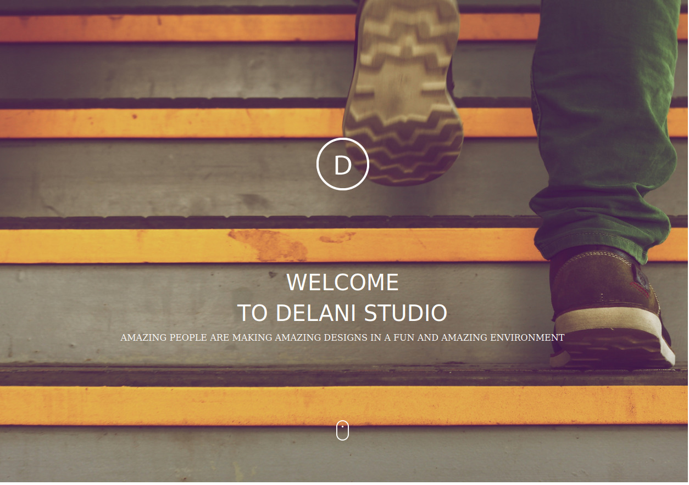

**Author**

Collins Koech

**Description**


This project is a web application for Delani studio that shows details about the services it offers, has information about the studio, a portfolio section and a form that enables users to send their messages and concern to Delani studios.

**Screenshot**



**Live page**


https://collins-koech.github.io/Delani-studio/ 

## Installation / Setup instruction
* Open Terminal {Ctrl+Alt+T}

* git clone ```https://github.com/collins-koech/Delani-studio```

* cd Delani-Studio

* code . or atom . depending on the text editor of your choise.

## Technologies Used

* [HTML5](https://github.com/topics/html5)
* [CSS](https://github.com/topics/css3)
* [Bootstrap](https://github.com/topics/bootstrap)
* [jQuery](https://github.com/topics/javascript)
* markdown

## BDD
| Behaviour      | Input        | Output       |
| :------------- | :----------: | -----------: |
|  Enter your name  |   Collins Koech  |     |
| Enter your Email Address  | Collinskoech875@gmail.com |   |
| Enter your message or comment   |  I would love to work with you     |     |
| Press Submit|     |Pop up "Collins Koech, we have received your message. Thank you for reaching out to us.|


**Design**


Our design practice offers a full range of services including brand strategy, interaction and visual design and user experience testing.
Throughout your project, our designers create and implement visual design and workflows, solicit user feedback and work with you to make sure what gets built is what is needed.

**Development**

All engineers are fluent in the latest enterprise, mobile and web development technologies.
They collaborate with your team to write, and improve code on a daily basis, using proven practices such as test-driven development and pair programming.

**Product Management**

Planning and development is iterative. Because we are constantly coding and testing, the products we build are always ready to go live. 
This iterative process allows for changes as business requirements evolve.
